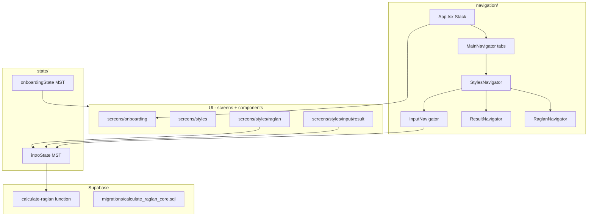

# Architecture

## App layers

## Measurement wizard (InputNavigator)

| Route | File | Notes |
|-------|------|--------|
| Index | `screens/styles/input/index.tsx` | Redirects to Head |
| Head … Fit | `head.tsx`, `neck.tsx`, `chest.tsx`, … | Shared |
| RibbingWidth | `ribbing-width.tsx` | regular |
| RibbingWidthV | `ribbing-widthV.tsx` | v-neck |
| LineraglanWidth | `lineraglan-width.tsx` | regular |
| LineraglanV | `lineraglanV.tsx` | v-neck |
| DepthNeckV | `depthneckV.tsx` | v-neck only |

Progress bar: `components/IntroProgress.tsx` (step list depends on `introState.style`).

## Result flow

`ResultNavigator` → `result.tsx` (facade) →

- `RegularResult.tsx` — large; steps `Step1Ribbing` … `Step4SeparatingSleeves`
- `VNeckResult.tsx` — parallel `Step*V.tsx` and `ResultStepV`, `FrontV`

Shared math exports: `helpers.ts` (re-exported from `index.tsx`).

## Raglan charts

`RaglanNavigator` registers Ribbing / Back / Front / Sleeve. Each stack screen is a **facade** (`ribbing.tsx`, etc.) routing to:

| Facade | Regular impl | V-neck impl |
|--------|--------------|-------------|
| ribbing | `ribbingO.tsx` | `ribbingV.tsx` |
| back | `backO.tsx` | `backV.tsx` |
| front | `frontO.tsx` | `frontV.tsx` |
| sleeve | `sleeveO.tsx` | `sleeveV.tsx` |

Shared chart logic (increase rows + grid renderers): `screens/styles/raglan/increaseRowSelection.ts`, `increaseArrayRenderers.tsx`. Stitch cm helpers: `utils/stitchMetrics.ts`.

Line-level edit map: `docs/HOTSPOTS.md`.

## Large files (prefer surgical edits)

| File | ~lines | Role |
|------|--------|------|
| `utils/i18n/strings/*.ts` | ~350–720 per domain | Per-locale UI copy |
| `utils/translations.ts` | ~15 | I18n bootstrap |
| `state/introState.ts` | 700+ | MST model + actions |
| `screens/styles/raglan/vNeckFrontGrid.tsx` | ~430 | V-neck front chart shaping (extracted from `frontV.tsx`) |
| `screens/styles/raglan/frontV.tsx` | ~590 | V-neck front chart layout + carousel |
| `screens/styles/raglan/ribbingV.tsx` | ~810 | V-neck collar chart layout |
| `screens/styles/raglan/ribbingVCollarGrid.ts` | ~95 | V-neck collar increase dispatch |
| `screens/styles/input/result/RegularResult.tsx` | ~160 | Regular result orchestrator |
| `screens/styles/input/result/RegularResultSummary.tsx` | ~320 | Final corpus/sleeve summary |
| `state/introStatePersistedKeys.ts` | ~160 | AsyncStorage field whitelist |
| `screens/styles/input/result/increaseRows*.ts` | ~550 total | Increase-row algorithms |
| `utils/raglan/` | modular | Calc core + types (see `docs/RAGLAN_GLOSSARY.md`) |

## Path alias

`@/*` → project root (`tsconfig.json`).
